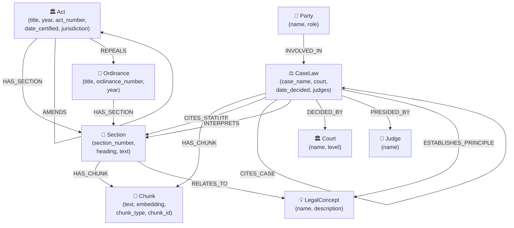

# Neo4j GraphRAG Implementation Plan — LankaLawBot

> **Goal:** Add a parallel **Neo4j GraphRAG** retrieval backend alongside the existing Pinecone pipeline so that both can be benchmarked head-to-head on the same evaluation datasets. Neo4j will combine **Vector Search + Full-text Keyword Search + Cypher Graph Traversal + Metadata Filters** to improve accuracy and maintain relational context between Sri Lankan acts, case laws, amendments, and legal concepts.

---

## Table of Contents

1. [Motivation & Value Proposition](#1-motivation--value-proposition)
2. [Architecture Overview](#2-architecture-overview)
3. [Neo4j Local Infrastructure Setup](#3-neo4j-local-infrastructure-setup)
4. [Graph Schema Design](#4-graph-schema-design)
5. [Embedding Model Selection](#5-embedding-model-selection)
6. [Ingestion Pipeline](#6-ingestion-pipeline)
7. [Index Creation (Vector + Full-Text)](#7-index-creation-vector--full-text)
8. [Hybrid Retrieval Pipeline](#8-hybrid-retrieval-pipeline)
9. [Cross-Encoder Reranking & Deduplication](#9-cross-encoder-reranking--deduplication)
10. [Integration with Existing Agent Orchestrator](#10-integration-with-existing-agent-orchestrator)
11. [Configuration & Environment Variables](#11-configuration--environment-variables)
12. [Benchmarking: Pinecone vs Neo4j GraphRAG](#12-benchmarking-pinecone-vs-neo4j-graphrag)
13. [File Structure & Module Map](#13-file-structure--module-map)
14. [Implementation Phases & Timeline](#14-implementation-phases--timeline)
15. [Risk Mitigation & Rollback Strategy](#15-risk-mitigation--rollback-strategy)

---

## 1. Motivation & Value Proposition

### Why GraphRAG over pure Vector Search?

| Capability | Pinecone (Current) | Neo4j GraphRAG (Proposed) |
|:---|:---|:---|
| Semantic similarity | ✅ Dense embeddings | ✅ Dense embeddings |
| Keyword exact match | ✅ BM25 FTS index | ✅ Native full-text index (Lucene) |
| Structural relationships | ❌ Flat document store | ✅ `CITES`, `AMENDS`, `REPEALS`, `INTERPRETS` edges |
| Amendment tracking | ❌ Manual metadata | ✅ Graph traversal with `valid_from`/`valid_to` |
| Multi-hop reasoning | ❌ Single retrieval | ✅ Cypher path traversal (1–3 hops) |
| Cross-reference discovery | ❌ | ✅ Find all cases citing a section, etc. |
| Metadata-filtered traversal | ⚠️ Post-filter only | ✅ Native index-level filtering |

### Sri Lankan Legal Corpus — Specific Advantages

Sri Lankan law has unique characteristics that make graph databases especially valuable:

- **Acts frequently amend prior ordinances** (e.g., Rent Act No. 7 of 1972 amends Rent Restriction Ordinance) → `AMENDS` edges
- **Case law cites multiple statutes** (e.g., *Subramaniam v. Nadarajah* cites Sections 4, 7 of Evidence Ordinance) → `CITES` edges
- **Legal principles span multiple acts** (e.g., "tenancy termination" touches Rent Act + Civil Procedure Code + Evidence Ordinance) → `LegalConcept` nodes + graph traversal
- **Amendments invalidate prior sections** → temporal versioning on graph edges

---

## 2. Architecture Overview

```
┌──────────────────────────────────────────────────────────────────┐
│                      LankaLawBot Backend                        │
│                                                                  │
│  ┌──────────────────────────────────────────────────────────┐   │
│  │                  agent.py (Orchestrator)                  │   │
│  │                                                          │   │
│  │   RetrievalPlan → backend_selector → chosen_service      │   │
│  └──────────┬───────────────────────────────┬───────────────┘   │
│             │                               │                    │
│    ┌────────▼────────┐           ┌──────────▼──────────┐        │
│    │ PineconeRetrieval│           │  Neo4jGraphRAG       │        │
│    │ Service (existing)│           │  RetrievalService    │        │
│    │                  │           │  (NEW)               │        │
│    │ ├─ Dense Search  │           │  ├─ Vector Search    │        │
│    │ ├─ BM25 FTS     │           │  ├─ Full-text FTS    │        │
│    │ ├─ RRF Fusion   │           │  ├─ Cypher Traversal │        │
│    │ ├─ Cross-Encoder │           │  ├─ Metadata Filter  │        │
│    │ └─ Parent Expand │           │  ├─ RRF Fusion       │        │
│    └─────────────────┘           │  ├─ Cross-Encoder    │        │
│                                  │  ├─ Deduplication    │        │
│                                  │  └─ Parent Expand    │        │
│                                  └──────────────────────┘        │
│                                           │                      │
│                                  ┌────────▼────────┐             │
│                                  │   Neo4j 5 CE    │             │
│                                  │   (Docker)      │             │
│                                  │                 │             │
│                                  │  ┌───────────┐  │             │
│                                  │  │ Graph DB  │  │             │
│                                  │  │ + Vector  │  │             │
│                                  │  │ + FTS Idx │  │             │
│                                  │  └───────────┘  │             │
│                                  └─────────────────┘             │
└──────────────────────────────────────────────────────────────────┘
```

### Key Design Principle: Parallel, Not Replacement

The Neo4j service will be a **drop-in alternative** to the existing `RetrievalService`. Both share the same output contract (`list[dict]` with `child`, `parent`, `metadata` keys) so the downstream `ContextAssembler` and `GenerationService` work unchanged.

---

## 3. Neo4j Local Infrastructure Setup

### 3.1 Docker Compose

Create [docker-compose.neo4j.yml](file:///c:/Projects/lanka-law-bot/backend/docker-compose.neo4j.yml):

```yaml
services:
  neo4j:
    image: neo4j:5-community
    container_name: lanka-law-neo4j
    ports:
      - "7474:7474"    # Browser UI
      - "7687:7687"    # Bolt protocol
    environment:
      NEO4J_AUTH: neo4j/lankalawbot2026
      NEO4J_PLUGINS: '[]'
      NEO4J_server_memory_heap_initial__size: "512m"
      NEO4J_server_memory_heap_max__size: "1g"
      NEO4J_server_memory_pagecache_size: "512m"
      # Enable vector index support (built-in for Neo4j 5.x)
      NEO4J_dbms_security_procedures_unrestricted: "apoc.*"
    volumes:
      - neo4j_data:/data
      - neo4j_logs:/logs
    restart: unless-stopped
    healthcheck:
      test: ["CMD-SHELL", "neo4j status || exit 1"]
      interval: 30s
      timeout: 10s
      retries: 3

volumes:
  neo4j_data:
  neo4j_logs:
```

### 3.2 Startup Commands

```bash
# Start Neo4j
docker compose -f docker-compose.neo4j.yml up -d

# Verify running
docker compose -f docker-compose.neo4j.yml ps

# Access Browser UI
# Open http://localhost:7474 in your browser

# Connect with Python
python -c "from neo4j import GraphDatabase; d=GraphDatabase.driver('bolt://localhost:7687', auth=('neo4j','lankalawbot2026')); d.verify_connectivity(); print('Connected!'); d.close()"
```

### 3.3 Python Dependencies

Add to [requirements.txt](file:///c:/Projects/lanka-law-bot/backend/requirements.txt):

```
neo4j>=5.20.0
neo4j-graphrag>=1.5.0
```

---

## 4. Graph Schema Design

### 4.1 Node Types

This schema is specifically designed for the Sri Lankan legal corpus, mapping the hierarchical structure of Acts, Ordinances, and Case Law into a navigable knowledge graph.



### 4.2 Detailed Node Properties

#### `Act` Node

```
(:Act {
  act_id: "act_1995_21",                     // Deterministic ID
  title: "Commercial Mediation Act",
  short_title: "Commercial Mediation Act No. 21 of 1995",
  act_number: 21,
  year: 1995,
  date_certified: "1995-08-23",
  date_enacted: "1995-09-01",
  jurisdiction: "Sri Lanka",
  source_type: "act",
  doc_type: "primary_legislation",
  subject_area: "commercial",
  source_filename: "Year_1995_Act_21.json",
  keywords: ["mediation", "commercial", "dispute"],
  parent_act: null,                           // For amendment acts
  is_current: true                            // Versioning flag
})
```

#### `Section` Node

```
(:Section {
  section_id: "act_1995_21_s4",
  section_number: "4",
  heading: "Appointment of Mediators",
  full_text: "...",                           // Full section text
  breadcrumb: "Commercial Mediation Act > Part I > Section 4",
  heading_path: ["Part I", "Section 4"],
  act_id: "act_1995_21"
})
```

#### `Chunk` Node (Vectorized)

```
(:Chunk {
  chunk_id: "uuid-based-hash",               // Same ID scheme as current
  text: "The appointed mediator shall...",    // Chunk text for FTS + display
  embedding: [0.012, -0.034, ...],           // 384-dim vector
  chunk_type: "child",                        // "parent" | "child" | "section_summary"
  chunk_strategy: "legal_clause",
  parent_chunk_id: "parent-uuid",            // Link to parent chunk
  text_hash: "sha256...",
  section_id: "act_1995_21_s4",
  act_id: "act_1995_21",
  // Denormalized metadata for filtered search:
  year: 1995,
  title: "Commercial Mediation Act",
  source_type: "act",
  doc_type: "primary_legislation",
  subject_area: "commercial",
  source_filename: "Year_1995_Act_21.json",
  breadcrumb: "Commercial Mediation Act > Part I > Section 4"
})
```

#### `CaseLaw` Node

```
(:CaseLaw {
  case_id: "case_2001_NLR_123",
  case_name: "Subramaniam v. Nadarajah",
  case_number: "SC Appeal 45/2001",
  court: "Supreme Court",
  date_decided: "2001-07-15",
  date_heard: ["2001-03-10", "2001-03-11"],
  reporter_citation: "[2001] 1 NLR 123",
  reporter_volume: "1 NLR",
  reporter_page: 123,
  plaintiff: "Subramaniam",
  defendant: "Nadarajah",
  judges: ["Mark Fernando J.", "Shirani Bandaranayake J."],
  legal_principles: ["burden of proof", "admissibility of evidence"],
  statutes_cited: ["Evidence Ordinance", "Civil Procedure Code"],
  cases_cited: ["Perera v. Silva [1998] 2 SLR 45"],
  jurisdiction: "Sri Lanka",
  source_type: "case_law"
})
```

#### `LegalConcept` Node

```
(:LegalConcept {
  concept_id: "concept_tenancy_termination",
  name: "Tenancy Termination",
  description: "Legal procedures and conditions for terminating tenancy agreements",
  aliases: ["eviction", "lease termination", "tenancy ending"]
})
```

### 4.3 Relationship Types

| Relationship | From → To | Properties | Purpose |
|:---|:---|:---|:---|
| `HAS_SECTION` | Act/Ordinance → Section | `order: int` | Structural hierarchy |
| `HAS_CHUNK` | Section/CaseLaw → Chunk | `order: int` | Chunk parentage |
| `HAS_CHILD_CHUNK` | Chunk → Chunk | — | Parent-child chunk link |
| `AMENDS` | Act → Act | `valid_from, sections_affected` | Amendment tracking |
| `REPEALS` | Act → Act/Ordinance | `valid_from, partial: bool` | Repeal tracking |
| `CITES_STATUTE` | CaseLaw → Section | `context: str` | Case-to-law reference |
| `CITES_CASE` | CaseLaw → CaseLaw | `treatment: str` | Case precedent chain |
| `INTERPRETS` | CaseLaw → Section | `interpretation: str` | Judicial interpretation |
| `DECIDED_BY` | CaseLaw → Court | — | Court venue |
| `PRESIDED_BY` | CaseLaw → Judge | `role: str` | Judge assignment |
| `INVOLVED_IN` | Party → CaseLaw | `role: str` | Party participation |
| `RELATES_TO` | Section/CaseLaw → LegalConcept | `relevance: float` | Concept tagging |
| `ESTABLISHES_PRINCIPLE` | CaseLaw → LegalConcept | — | Precedent principles |

### 4.4 Cypher Schema Creation

```cypher
// Constraints (unique IDs)
CREATE CONSTRAINT act_id IF NOT EXISTS FOR (a:Act) REQUIRE a.act_id IS UNIQUE;
CREATE CONSTRAINT section_id IF NOT EXISTS FOR (s:Section) REQUIRE s.section_id IS UNIQUE;
CREATE CONSTRAINT chunk_id IF NOT EXISTS FOR (c:Chunk) REQUIRE c.chunk_id IS UNIQUE;
CREATE CONSTRAINT case_id IF NOT EXISTS FOR (cl:CaseLaw) REQUIRE cl.case_id IS UNIQUE;
CREATE CONSTRAINT concept_id IF NOT EXISTS FOR (lc:LegalConcept) REQUIRE lc.concept_id IS UNIQUE;
CREATE CONSTRAINT court_name IF NOT EXISTS FOR (ct:Court) REQUIRE ct.name IS UNIQUE;
CREATE CONSTRAINT judge_name IF NOT EXISTS FOR (j:Judge) REQUIRE j.name IS UNIQUE;

// Indexes for common filter patterns
CREATE INDEX chunk_year IF NOT EXISTS FOR (c:Chunk) ON (c.year);
CREATE INDEX chunk_source_type IF NOT EXISTS FOR (c:Chunk) ON (c.source_type);
CREATE INDEX chunk_type IF NOT EXISTS FOR (c:Chunk) ON (c.chunk_type);
CREATE INDEX chunk_title IF NOT EXISTS FOR (c:Chunk) ON (c.title);
CREATE INDEX section_act IF NOT EXISTS FOR (s:Section) ON (s.act_id);
```

---

## 5. Embedding Model Selection

### 5.1 Constraints

- **RAM:** 8 GB total system
- **VRAM:** 2 GB GPU
- **Must run locally** (no API costs)
- **Must embed legal text well** (distinguish "shall" vs "may", section references, etc.)

### 5.2 Recommended Model

> **Primary: `all-MiniLM-L6-v2`** (already used in the project)

| Property | Value |
|:---|:---|
| Parameters | ~22M |
| Dimensions | 384 |
| Memory footprint | ~80 MB |
| Inference speed | ~14,000 sentences/sec (CPU) |
| Max sequence length | 256 tokens |
| License | Apache 2.0 |

**Rationale:**
- Already proven in the current pipeline, enabling **apples-to-apples comparison** with Pinecone
- Fits comfortably in 2 GB VRAM with headroom for cross-encoder
- 384 dimensions = small vector storage footprint in Neo4j
- Neo4j vector index handles 384-dim vectors natively

### 5.3 Alternative (Higher Quality, If Budget Allows)

If you later want to evaluate a better model while staying within hardware limits:

| Model | Params | Dims | RAM Usage | Tradeoff |
|:---|:---|:---|:---|:---|
| `all-MiniLM-L6-v2` | 22M | 384 | ~80 MB | ✅ Current baseline |
| `BAAI/bge-small-en-v1.5` | 33M | 384 | ~130 MB | Slightly better retrieval quality |
| `Alibaba-NLP/gte-small` | 33M | 384 | ~130 MB | Strong on MTEB benchmarks |

> [!IMPORTANT]
> For a fair benchmark comparison (Pinecone vs Neo4j), **both pipelines must use the same embedding model**. Since Pinecone currently uses `llama-text-embed-v2` (2048-dim, Pinecone-hosted inference), the Neo4j pipeline should use its own local embeddings. This means we compare **retrieval architecture** differences, not embedding model differences.
>
> If you want to compare embedding models as well, run the Neo4j pipeline twice: once with `all-MiniLM-L6-v2` and once with the same model.

---

## 6. Ingestion Pipeline

### 6.1 Pipeline Overview

```
Raw JSON files (data/*.json)
         │
         ▼
┌─────────────────────────┐
│  Stage 1: Parse & Clean │  ← Reuse existing data_processor.py logic
│  • Load JSON blocks      │
│  • Extract metadata       │
│  • Clean text             │
└────────────┬────────────┘
             │
             ▼
┌─────────────────────────────┐
│  Stage 2: Structure Extract │  ← NEW: LLM-free metadata extraction
│  • Detect Act/Ordinance/Case│
│  • Extract sections, parts   │
│  • Parse citations            │
│  • Identify amendments        │
└────────────┬────────────────┘
             │
             ▼
┌─────────────────────────────┐
│  Stage 3: Legal Chunking    │  ← Reuse existing LegalDocumentChunker
│  • Structure-aware splitting │
│  • Parent-child hierarchy    │
│  • Section summaries         │
│  • Heading path tracking     │
└────────────┬────────────────┘
             │
             ▼
┌─────────────────────────────┐
│  Stage 4: Embed Chunks      │  ← all-MiniLM-L6-v2 (batch)
│  • Batch encode child chunks │
│  • Batch encode summaries    │
│  • Parent chunks: no embed   │
└────────────┬────────────────┘
             │
             ▼
┌──────────────────────────────────┐
│  Stage 5: Graph Construction     │  ← NEW: Core graph builder
│  • Create Act/Ordinance/Case     │
│  • Create Section nodes          │
│  • Create Chunk nodes + vectors  │
│  • Create relationships          │
│  • Create LegalConcept links     │
│  • MERGE-based idempotency       │
└────────────┬─────────────────────┘
             │
             ▼
┌──────────────────────────────────┐
│  Stage 6: Index Build            │
│  • Vector index on Chunk.embed   │
│  • Full-text index on Chunk.text │
│  • Property indexes              │
└──────────────────────────────────┘
```

### 6.2 Chunking Strategy

We reuse the proven `LegalDocumentChunker` approach from [legal_chunker.py](file:///c:/Projects/lanka-law-bot/backend/app/services/ingestion/legal_chunker.py) with the following parameters (matching current [config.py](file:///c:/Projects/lanka-law-bot/backend/app/core/config.py)):

| Parameter | Value | Rationale |
|:---|:---|:---|
| Parent chunk size | 2000 chars | Full section context for LLM |
| Parent chunk overlap | 200 chars | Cross-section continuity |
| Child chunk size | 500 chars | Embedding sweet-spot for MiniLM (256 tokens ≈ 500 chars) |
| Child chunk overlap | 100 chars | Clause boundary preservation |
| Strategy | Structure-first → clause-based → recursive fallback | Preserves legal document hierarchy |
| Summary chunks | Extractive (first 2 sentences + heading path) | Enables broad retrieval |

The chunking pipeline:
1. **Split by Markdown headings** (H1–H6) — preserves structural sections
2. **Split by legal clause patterns** (`Section X`, `Clause X`, `(a)`, `1.2.3`) — when section > 350 chars
3. **Window-based sub-splitting** — parent → child with overlap
4. **Extractive summary generation** — heading path + first 2 sentences

### 6.3 Metadata Extraction (Rule-Based, No LLM)

Rather than using an LLM for entity extraction (expensive on 8GB RAM), we use **rule-based extractors** leveraging the existing metadata in [ChunkMetadata](file:///c:/Projects/lanka-law-bot/backend/app/schemas/ingestion.py):

```python
# Regex-based extractors:
# 1. Source filename → year, act_number: "Year_1995_Act_21.json"
# 2. Title blocks → title, short_title from first JSON text blocks
# 3. Amendment detection → "amends", "amendment to", "repeals" patterns
# 4. Citation extraction → "[Year] Vol Reporter Page" patterns
# 5. Section references → "Section X of [Act Name]" patterns
# 6. Court identification → "Supreme Court", "Court of Appeal", etc.
# 7. Judge names → "J.", "C.J.", "Justice" prefix patterns
```

### 6.4 Graph Construction — Cypher Batching

For performance on large corpora, use **batched `UNWIND` operations** instead of individual `CREATE` statements:

```python
# Example: Batch insert chunks with embeddings
CHUNK_BATCH_CYPHER = """
UNWIND $chunks AS chunk
MERGE (c:Chunk {chunk_id: chunk.chunk_id})
SET c.text = chunk.text,
    c.embedding = chunk.embedding,
    c.chunk_type = chunk.chunk_type,
    c.chunk_strategy = chunk.chunk_strategy,
    c.parent_chunk_id = chunk.parent_chunk_id,
    c.text_hash = chunk.text_hash,
    c.year = chunk.year,
    c.title = chunk.title,
    c.source_type = chunk.source_type,
    c.doc_type = chunk.doc_type,
    c.subject_area = chunk.subject_area,
    c.source_filename = chunk.source_filename,
    c.breadcrumb = chunk.breadcrumb,
    c.section_id = chunk.section_id,
    c.act_id = chunk.act_id
WITH c, chunk
MATCH (s:Section {section_id: chunk.section_id})
MERGE (s)-[:HAS_CHUNK]->(c)
"""

# Batch insert parent-child relationships
PARENT_CHILD_CYPHER = """
UNWIND $pairs AS pair
MATCH (parent:Chunk {chunk_id: pair.parent_id})
MATCH (child:Chunk {chunk_id: pair.child_id})
MERGE (parent)-[:HAS_CHILD_CHUNK]->(child)
"""
```

### 6.5 Idempotency

All graph mutations use **`MERGE` (not `CREATE`)** keyed on deterministic IDs:
- `act_id` = `f"act_{year}_{act_number}"`
- `section_id` = `f"{act_id}_s{section_number}"`
- `chunk_id` = UUID5 based on `document_id:chunk_type:section_index:chunk_index:text_hash` (same as current system)

This enables **incremental updates**: re-running the pipeline on updated documents will update existing nodes without creating duplicates.

---

## 7. Index Creation (Vector + Full-Text)

### 7.1 Vector Index

```cypher
CREATE VECTOR INDEX `chunk-embeddings` IF NOT EXISTS
FOR (c:Chunk) ON (c.embedding)
OPTIONS {
  indexConfig: {
    `vector.dimensions`: 384,
    `vector.similarity_function`: 'cosine'
  }
};
```

### 7.2 Full-Text Index

```cypher
CREATE FULLTEXT INDEX `chunk-fulltext` IF NOT EXISTS
FOR (c:Chunk) ON EACH [c.text];

-- Optional: Title-level full-text for act/case name searches
CREATE FULLTEXT INDEX `act-fulltext` IF NOT EXISTS
FOR (a:Act) ON EACH [a.title, a.short_title];

CREATE FULLTEXT INDEX `case-fulltext` IF NOT EXISTS
FOR (cl:CaseLaw) ON EACH [cl.case_name];
```

### 7.3 Index Verification

```cypher
SHOW INDEXES;
-- Verify all indexes show state: "ONLINE"
```

---

## 8. Hybrid Retrieval Pipeline

### 8.1 Pipeline Overview

```
User Query
     │
     ├─────────────────────────┬──────────────────────┬──────────────────────┐
     ▼                         ▼                      ▼                      ▼
┌─────────────┐     ┌──────────────────┐    ┌─────────────────┐    ┌─────────────────┐
│ Vector Search│     │Full-Text Search  │    │Cypher Traversal │    │Metadata Filter  │
│(384-dim cos) │     │(Lucene BM25)     │    │(1-3 hop)        │    │(year, type)     │
│ top_k = 30   │     │ top_k = 30       │    │ structured query │    │ pre-filter      │
└──────┬───────┘     └────────┬─────────┘    └────────┬────────┘    └────────┬────────┘
       │                      │                       │                      │
       └──────────────────────┼───────────────────────┼──────────────────────┘
                              ▼
                    ┌──────────────────────┐
                    │ Weighted Reciprocal  │
                    │ Rank Fusion (WRRF)   │
                    │ w_vec=0.4, w_fts=0.3 │
                    │ w_graph=0.3          │
                    └──────────┬───────────┘
                               ▼
                    ┌──────────────────────┐
                    │ Aggressive Dedup     │
                    │ (chunk_id + content  │
                    │  fingerprint)        │
                    └──────────┬───────────┘
                               ▼
                    ┌──────────────────────┐
                    │ Cross-Encoder        │
                    │ Reranking            │
                    │ ms-marco-MiniLM-L-6  │
                    │ top_n = 15           │
                    └──────────┬───────────┘
                               ▼
                    ┌──────────────────────┐
                    │ Low-Relevance Prune  │
                    │ (threshold = 0.0)    │
                    └──────────┬───────────┘
                               ▼
                    ┌──────────────────────┐
                    │ Parent Expansion     │
                    │ (graph traversal)    │
                    └──────────┬───────────┘
                               ▼
                    list[dict] → ContextAssembler
```

### 8.2 Vector Search (Cypher)

```cypher
// Vector search with optional metadata pre-filtering
CALL db.index.vector.queryNodes('chunk-embeddings', $top_k, $query_embedding)
YIELD node AS chunk, score
WHERE chunk.chunk_type = 'child'
  AND ($year_filter IS NULL OR chunk.year = $year_filter)
  AND ($source_type_filter IS NULL OR chunk.source_type = $source_type_filter)
RETURN chunk, score
ORDER BY score DESC
LIMIT $top_k
```

### 8.3 Full-Text Search (Cypher)

```cypher
// BM25 full-text search
CALL db.index.fulltext.queryNodes('chunk-fulltext', $query_text)
YIELD node AS chunk, score
WHERE chunk.chunk_type = 'child'
  AND ($year_filter IS NULL OR chunk.year = $year_filter)
RETURN chunk, score
ORDER BY score DESC
LIMIT $top_k
```

### 8.4 Cypher Graph Traversal

This is what **distinguishes GraphRAG from flat vector search** — retrieving contextually related chunks via graph topology:

```cypher
// Strategy 1: Find chunks from the same Act + related Acts
// Given a set of chunk_ids from vector/FTS results, expand context
UNWIND $seed_chunk_ids AS seed_id
MATCH (seed:Chunk {chunk_id: seed_id})

// Get the parent Act/Section
OPTIONAL MATCH (seed)<-[:HAS_CHUNK]-(section:Section)<-[:HAS_SECTION]-(act:Act)

// Traverse to related Acts (amendments, repeals)
OPTIONAL MATCH (act)-[:AMENDS|REPEALS]->(related_act:Act)
              -[:HAS_SECTION]->(related_section:Section)
              -[:HAS_CHUNK]->(related_chunk:Chunk {chunk_type: 'child'})

RETURN DISTINCT related_chunk AS chunk, 
       'graph_amendment' AS retrieval_source,
       related_act.title AS related_title
LIMIT $graph_limit
```

```cypher
// Strategy 2: Find case law that cites the same statute section
UNWIND $seed_chunk_ids AS seed_id
MATCH (seed:Chunk {chunk_id: seed_id})<-[:HAS_CHUNK]-(section:Section)
OPTIONAL MATCH (case:CaseLaw)-[:CITES_STATUTE|INTERPRETS]->(section)
              -[:HAS_CHUNK]->(case_chunk:Chunk {chunk_type: 'child'})
RETURN DISTINCT case_chunk AS chunk,
       'graph_case_citation' AS retrieval_source,
       case.case_name AS related_case
LIMIT $graph_limit
```

```cypher
// Strategy 3: Concept-based expansion
UNWIND $seed_chunk_ids AS seed_id
MATCH (seed:Chunk {chunk_id: seed_id})<-[:HAS_CHUNK]-(section:Section)
      -[:RELATES_TO]->(concept:LegalConcept)
      <-[:RELATES_TO]-(other_section:Section)
      -[:HAS_CHUNK]->(concept_chunk:Chunk {chunk_type: 'child'})
WHERE other_section <> section
RETURN DISTINCT concept_chunk AS chunk,
       'graph_concept' AS retrieval_source,
       concept.name AS related_concept
LIMIT $graph_limit
```

### 8.5 Metadata Filters

Metadata filtering happens at the **Cypher query level** (not post-filter):

```python
# Build dynamic WHERE clauses based on RetrievalPlan
filters = []
params = {}

if retrieval_plan.year_filter:
    filters.append("chunk.year = $year_filter")
    params["year_filter"] = retrieval_plan.year_filter

if retrieval_plan.act_name_filter:
    filters.append("toLower(chunk.title) CONTAINS toLower($act_name_filter)")
    params["act_name_filter"] = retrieval_plan.act_name_filter

where_clause = " AND ".join(filters) if filters else "TRUE"
```

### 8.6 Weighted Reciprocal Rank Fusion (WRRF)

```python
def weighted_reciprocal_rank_fusion(
    ranked_lists: list[list[Document]],
    weights: list[float],      # e.g., [0.4, 0.3, 0.3] for [vector, fts, graph]
    k: int = 60,
) -> list[Document]:
    """
    WRRF: Like RRF but each ranked list gets a weight multiplier.
    
    Score(doc) = Σ weight_i / (k + rank_i)
    """
    scores: dict[str, float] = {}
    docs_by_key: dict[str, Document] = {}

    for weight, ranked_list in zip(weights, ranked_lists):
        for rank, doc in enumerate(ranked_list, start=1):
            key = retrieval_dedup_key(doc)
            scores[key] = scores.get(key, 0.0) + weight / (k + rank)
            docs_by_key.setdefault(key, doc)

    return [
        docs_by_key[key]
        for key, _ in sorted(scores.items(), key=lambda x: x[1], reverse=True)
    ]
```

---

## 9. Cross-Encoder Reranking & Deduplication

### 9.1 Cross-Encoder

Reuse the exact same cross-encoder as the current pipeline for fair comparison:

- **Model:** `cross-encoder/ms-marco-MiniLM-L-6-v2` (from [config.py](file:///c:/Projects/lanka-law-bot/backend/app/core/config.py#L65))
- **top_n:** 15
- **Memory:** ~80 MB — fits in 2 GB VRAM alongside embedding model

### 9.2 Aggressive Deduplication Strategy

The Neo4j pipeline has **more dedup surface area** because graph traversal can return the same chunk via different paths:

```python
def deduplicate_results(candidates: list[Document]) -> list[Document]:
    """
    Three-layer deduplication:
    1. chunk_id exact match (fastest)
    2. text_hash exact match (content-identical from different paths)
    3. Content fingerprint (first 500 chars, catches near-duplicates)
    """
    seen_chunk_ids: set[str] = set()
    seen_text_hashes: set[str] = set()
    seen_content: set[str] = set()
    unique: list[Document] = []

    for doc in candidates:
        meta = doc.metadata or {}
        
        # Layer 1: chunk_id
        chunk_id = meta.get("chunk_id", "")
        if chunk_id and chunk_id in seen_chunk_ids:
            continue
        
        # Layer 2: text_hash
        text_hash = meta.get("text_hash", "")
        if text_hash and text_hash in seen_text_hashes:
            continue
        
        # Layer 3: content prefix fingerprint
        content_key = doc.page_content[:500].strip().lower()
        if content_key in seen_content:
            continue

        if chunk_id:
            seen_chunk_ids.add(chunk_id)
        if text_hash:
            seen_text_hashes.add(text_hash)
        seen_content.add(content_key)
        unique.append(doc)

    return unique
```

---

## 10. Integration with Existing Agent Orchestrator

### 10.1 Backend Selector Pattern

The key integration point is in [agent.py](file:///c:/Projects/lanka-law-bot/backend/app/agent.py). We introduce a **backend selector** that routes retrieval to either Pinecone or Neo4j based on configuration:

```python
# In config.py — add:
RETRIEVAL_BACKEND: str = "pinecone"  # "pinecone" | "neo4j" | "both"
```

```python
# In agent.py — modify service initialization:
if settings.RETRIEVAL_BACKEND == "neo4j":
    _retrieval = get_neo4j_retrieval_service()
elif settings.RETRIEVAL_BACKEND == "both":
    _retrieval_pinecone = get_retrieval_service()
    _retrieval_neo4j = get_neo4j_retrieval_service()
else:
    _retrieval = get_retrieval_service()
```

### 10.2 Output Contract

Both services return the same structure consumed by [MultiSourceContextAssembler](file:///c:/Projects/lanka-law-bot/backend/app/services/generation/context_assembler.py):

```python
# Both RetrievalService and Neo4jRetrievalService return:
list[dict] where each dict = {
    "child": Document,       # The matched child chunk
    "parent": Document | None,  # Expanded parent context
    "metadata": dict,        # Full structured metadata
}
```

### 10.3 Graph-Enhanced Context Assembly

For Neo4j, the `metadata` dict can include **extra graph context** that enriches the LLM prompt:

```python
# Additional metadata from graph traversal:
{
    "child": Document(...),
    "parent": Document(...),
    "metadata": {
        # ... standard fields ...
        "graph_context": {
            "amending_acts": ["Act No. 5 of 2003"],
            "citing_cases": ["Perera v. Silva [2005]"],
            "related_concepts": ["tenancy termination"],
            "amendment_status": "amended_by_act_2003_5",
        }
    }
}
```

---

## 11. Configuration & Environment Variables

### 11.1 New Settings in [config.py](file:///c:/Projects/lanka-law-bot/backend/app/core/config.py)

```python
# === Neo4j Settings ===
RETRIEVAL_BACKEND: str = "pinecone"           # "pinecone" | "neo4j" | "both"

NEO4J_URI: str = "bolt://localhost:7687"
NEO4J_USER: str = "neo4j"
NEO4J_PASSWORD: str = ""
NEO4J_DATABASE: str = "neo4j"                 # Default database name

# Neo4j Embedding (local)
NEO4J_EMBEDDING_MODEL: str = "all-MiniLM-L6-v2"
NEO4J_EMBEDDING_DIMENSION: int = 384

# Neo4j Index Names
NEO4J_VECTOR_INDEX_NAME: str = "chunk-embeddings"
NEO4J_FULLTEXT_INDEX_NAME: str = "chunk-fulltext"

# Neo4j Retrieval Tuning
NEO4J_VECTOR_CANDIDATES_K: int = 30
NEO4J_FTS_CANDIDATES_K: int = 30
NEO4J_GRAPH_TRAVERSAL_LIMIT: int = 15
NEO4J_VECTOR_WEIGHT: float = 0.4
NEO4J_FTS_WEIGHT: float = 0.3
NEO4J_GRAPH_WEIGHT: float = 0.3

# Neo4j Ingestion
NEO4J_BATCH_SIZE: int = 100
```

### 11.2 New `.env` Variables

```env
# Neo4j (add to backend/.env)
NEO4J_URI=bolt://localhost:7687
NEO4J_USER=neo4j
NEO4J_PASSWORD=lankalawbot2026
RETRIEVAL_BACKEND=neo4j
```

---

## 12. Benchmarking: Pinecone vs Neo4j GraphRAG

### 12.1 Evaluation Framework

Use the existing [evaluation](file:///c:/Projects/lanka-law-bot/backend/evaluation) infrastructure and [benchmarks/datasets](file:///c:/Projects/lanka-law-bot/backend/benchmarks/datasets) to run identical queries against both backends.

### 12.2 Benchmark Dimensions

| Metric | How Measured | Tool |
|:---|:---|:---|
| **Retrieval Precision@K** | % of top-K chunks that are relevant | Custom eval |
| **Retrieval Recall@K** | % of relevant chunks found in top-K | Custom eval |
| **MRR (Mean Reciprocal Rank)** | Rank of first relevant result | Custom eval |
| **Context Relevance** | LLM-as-judge (Gemini) scores context | RAGAS |
| **Answer Correctness** | LLM-as-judge compares to ground truth | RAGAS |
| **Faithfulness** | % of claims grounded in retrieved context | RAGAS |
| **Latency (P50, P95)** | End-to-end retrieval time | Timer |
| **Graph Traversal Hit Rate** | % of queries where graph adds new relevant context | Custom |

### 12.3 Ablation Studies

Run the Neo4j pipeline with different component combinations to isolate contribution of each signal:

| Ablation | Vector | FTS | Graph | Expected Insight |
|:---|:---|:---|:---|:---|
| Neo4j-Vector-Only | ✅ | ❌ | ❌ | Baseline: does Neo4j vector match Pinecone? |
| Neo4j-Hybrid | ✅ | ✅ | ❌ | Does adding FTS help? |
| Neo4j-Full-GraphRAG | ✅ | ✅ | ✅ | Does graph traversal improve results? |
| Neo4j-Graph-Only | ❌ | ❌ | ✅ | How much can graph traversal contribute alone? |
| Pinecone-Hybrid | ✅ | ✅ | ❌ | Existing baseline |

### 12.4 Test Query Categories

From existing [benchmark datasets](file:///c:/Projects/lanka-law-bot/backend/benchmarks/datasets):

| Category | File | # Queries | GraphRAG Advantage |
|:---|:---|:---|:---|
| Quick QA | `quick_qa.json` | ~20 | Metadata filtering |
| Deep Research | `deep_research.json` | ~25 | Multi-hop graph traversal |
| Reasoning | `reasoning.json` | ~30 | Cross-reference discovery |
| Drafting | `drafting.json` | ~20 | Broad concept retrieval |
| Verification | `verify.json` | ~15 | Amendment chain traversal |

---

## 13. File Structure & Module Map

### New files to create:

```
backend/
├── docker-compose.neo4j.yml                       # Neo4j Docker setup
├── app/
│   ├── core/
│   │   └── config.py                              # MODIFY: add Neo4j settings
│   ├── services/
│   │   ├── retrieval/
│   │   │   ├── neo4j_graph_store.py               # NEW: Neo4j connection + CRUD
│   │   │   ├── neo4j_retrieval_service.py         # NEW: Hybrid retrieval pipeline
│   │   │   ├── neo4j_retrievers.py                # NEW: LangChain retriever wrappers
│   │   │   └── __init__.py                        # MODIFY: export Neo4j classes
│   │   ├── ingestion/
│   │   │   ├── neo4j_graph_builder.py             # NEW: Graph construction pipeline
│   │   │   ├── neo4j_legal_metadata_extractor.py  # NEW: Rule-based metadata extraction
│   │   │   └── __init__.py                        # MODIFY: export Neo4j classes
│   ├── agent.py                                   # MODIFY: backend selector
├── scripts/
│   ├── ingest_to_neo4j.py                         # NEW: CLI ingestion script
│   ├── setup_neo4j_schema.py                      # NEW: Schema + index creation
│   └── benchmark_comparison.py                    # NEW: Side-by-side eval runner
```

### Module Dependency Graph:

```
agent.py
    └── neo4j_retrieval_service.py
            ├── neo4j_graph_store.py (connection, queries)
            ├── neo4j_retrievers.py (LangChain wrappers)
            ├── retrieval_fusion.py (WRRF - shared)
            └── Cross-Encoder (shared with Pinecone)

ingest_to_neo4j.py
    ├── data_processor.py (existing JSON loading)
    ├── legal_chunker.py (existing chunking)
    ├── neo4j_legal_metadata_extractor.py (NEW)
    └── neo4j_graph_builder.py (NEW - Cypher batching)
```

---

## 14. Implementation Phases & Timeline

### Phase 1: Infrastructure & Schema (1-2 days)

- [ ] Set up Neo4j Docker container
- [ ] Create `docker-compose.neo4j.yml`
- [ ] Add Python dependencies (`neo4j`, `neo4j-graphrag`)
- [ ] Create `setup_neo4j_schema.py` (constraints + indexes)
- [ ] Add Neo4j settings to `config.py` and `.env`
- [ ] Verify connectivity

### Phase 2: Ingestion Pipeline (3-4 days)

- [ ] Create `neo4j_legal_metadata_extractor.py` (rule-based extractors)
- [ ] Create `neo4j_graph_builder.py` (Cypher batch operations)
- [ ] Create `ingest_to_neo4j.py` (CLI entry point)
- [ ] Adapt `LegalDocumentChunker` for Neo4j metadata format
- [ ] Implement embedding generation with `all-MiniLM-L6-v2`
- [ ] Implement batched graph construction (MERGE-based)
- [ ] Implement relationship creation (AMENDS, CITES, etc.)
- [ ] Test with 5-10 sample documents
- [ ] Full corpus ingestion + verification

### Phase 3: Retrieval Pipeline (3-4 days)

- [ ] Create `neo4j_graph_store.py` (driver wrapper + query methods)
- [ ] Implement vector search method
- [ ] Implement full-text search method
- [ ] Implement Cypher graph traversal queries (3 strategies)
- [ ] Implement metadata filter injection
- [ ] Implement WRRF fusion
- [ ] Implement 3-layer deduplication
- [ ] Create `neo4j_retrieval_service.py` (orchestrator)
- [ ] Create `neo4j_retrievers.py` (LangChain wrappers)
- [ ] Wire into existing cross-encoder reranking
- [ ] Wire parent expansion via graph query

### Phase 4: Integration & Testing (2-3 days)

- [ ] Add backend selector to `agent.py`
- [ ] Update `__init__.py` exports
- [ ] Ensure `ContextAssembler` handles graph-enriched metadata
- [ ] End-to-end test: query → retrieval → generation → response
- [ ] Verify output format matches existing `LegalResponse` schema

### Phase 5: Benchmarking (2-3 days)

- [ ] Create `benchmark_comparison.py`
- [ ] Run ablation studies (vector-only, hybrid, full GraphRAG)
- [ ] Run full benchmark on all 8 dataset files
- [ ] Collect latency measurements
- [ ] Generate comparison report (Precision, Recall, MRR, RAGAS)
- [ ] Analyze graph traversal hit rate

### Total Estimated Timeline: **11-16 days**

---

## 15. Risk Mitigation & Rollback Strategy

### 15.1 Risks

| Risk | Impact | Mitigation |
|:---|:---|:---|
| Neo4j memory pressure on 8GB RAM | OOM during ingestion/query | Limit heap to 1GB, pagecache to 512MB in Docker config |
| Embedding model too slow on CPU | Slow ingestion | Batch processing (100 chunks/batch), use GPU if available |
| Graph traversal returns too much noise | Low precision | Tune `NEO4J_GRAPH_TRAVERSAL_LIMIT`, add relevance scoring |
| Schema bloat from metadata extraction | Slow queries | Keep schema focused; start with Act/Section/Chunk only |
| Docker networking issues on Windows | Can't connect | Use `host.docker.internal` or `localhost` |

### 15.2 Rollback Strategy

Since Neo4j is a **parallel backend**, rollback is trivial:

```python
# In .env, just switch:
RETRIEVAL_BACKEND=pinecone  # Instantly falls back to existing system
```

No data migration or code removal required. The Neo4j container can remain running for future experiments.

### 15.3 Incremental Adoption

1. **Phase 1-4:** Neo4j runs in parallel, only activated via `RETRIEVAL_BACKEND=neo4j`
2. **Phase 5:** Benchmarks determine if Neo4j is superior
3. **If yes:** Gradually migrate to Neo4j as primary (keep Pinecone as fallback)
4. **If no:** Keep Pinecone; Neo4j remains for graph-specific queries only

---

> [!TIP]
> **Recommended first step:** Run `docker compose -f docker-compose.neo4j.yml up -d` to get Neo4j running, then execute the schema setup script. This validates infrastructure before writing any ingestion code.

> [!NOTE]
> This plan preserves the existing Pinecone pipeline entirely. All new code is additive — no existing files are deleted or broken.
